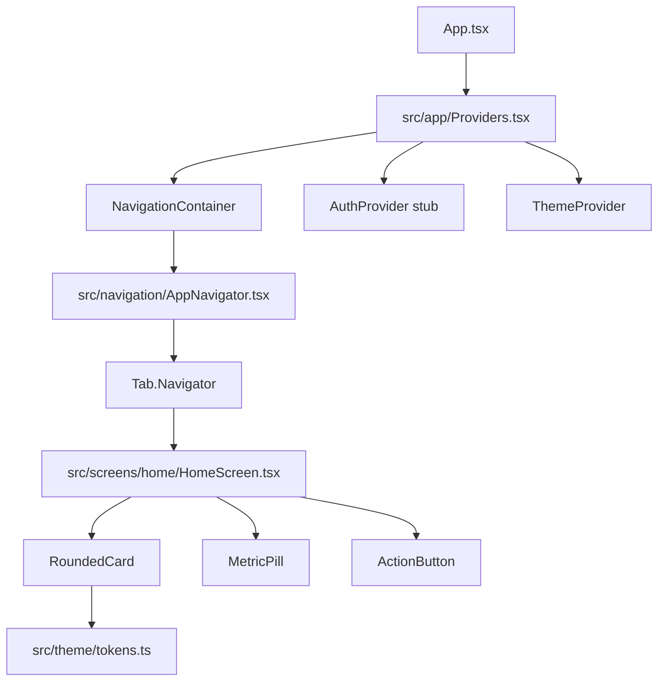

# Plano: feature/home-creator-ui

## Estado atual

| Área | Existe | Falta |
|------|--------|-------|
| Theme | [`colors.ts`](src/theme/colors.ts), [`spacing.ts`](src/theme/spacing.ts), [`typography.ts`](src/theme/typography.ts) | `tokens.ts`, `radius`, `shadow` |
| Types | [`Campaign`](src/types/campaign.ts), [`Influencer`](src/types/user.ts) | `coverImageUrl` opcional para cards |
| App | [`App.tsx`](App.tsx) com template `NewAppScreen` | Providers, navegação, HomeScreen |
| Infra | Jest smoke test | React Navigation, Testing Library, Storybook, Detox |



---

## 1. Dependências

Instalar pacotes necessários (nenhum existe hoje):

**Runtime**
- `@react-navigation/native`, `@react-navigation/bottom-tabs`
- `react-native-screens`, `react-native-gesture-handler`

**Dev / QA**
- `@testing-library/react-native`
- `@storybook/react-native`, `@storybook/addon-ondevice-controls`, `@storybook/addon-ondevice-actions`
- `detox`, `@types/detox` (ou tipos inline)

**Config nativa mínima**
- Importar `react-native-gesture-handler` no topo de [`index.js`](index.js)
- Wrap `MainActivity` com gesture handler (padrão React Navigation para Android)

---

## 2. Design tokens (consolidar)

Criar [`src/theme/tokens.ts`](src/theme/tokens.ts) como **fonte única**, reutilizando valores GlowUP já definidos:

```typescript
export const tokens = {
  colors: { primary, accent, bg, surface, text, muted, shadow, ... },
  spacing: { xs, sm, md, lg, xl },
  radius: { sm: 8, md: 16, lg: 24 },
  typography: { h1, h2, body, caption },
} as const;
```

- `primary` = `#7C3AED`, `accent` = `#EC4899` (de [`colors.ts`](src/theme/colors.ts))
- Atualizar [`colors.ts`](src/theme/colors.ts), [`spacing.ts`](src/theme/spacing.ts), [`typography.ts`](src/theme/typography.ts) para **re-exportar** de `tokens.ts` (backward compat)
- Atualizar [`src/theme/index.ts`](src/theme/index.ts) para exportar `tokens` como export principal

---

## 3. Types e mocks

**Estender [`Campaign`](src/types/campaign.ts)** com campo opcional para UI:

```typescript
coverImageUrl?: string; // ou ImageSourcePropType no mock local
```

**Criar [`src/screens/home/mocks.ts`](src/screens/home/mocks.ts)**
- `mockUser: Influencer` (nome "Ana", avatar placeholder)
- `mockMetrics`: Alcance, Engajamento, Ganhos
- `mockCampaigns`: 4–6 campanhas com status variados (`open`, `in_progress`, etc.)
- `mockFeaturedCampaigns`: subset para carrossel horizontal

**Exportar alias** `User = Influencer` em [`src/types/user.ts`](src/types/user.ts) se útil para greeting.

---

## 4. Assets placeholders

Criar [`src/assets/images/placeholders/`](src/assets/images/placeholders/):
- `camp1.jpg`, `camp2.jpg`, `camp3.jpg`, `avatar.png` → **`.gitkeep`** + [`README.md`](src/assets/images/placeholders/README.md) com dimensões (800×600, 128×128)
- Nos mocks, usar `require()` apontando para os paths (fallback: `Image` com `backgroundColor` do token quando arquivo ausente) **ou** URIs locais de placeholder estático gerado depois

Componentes devem tolerar imagem ausente (View colorido + ícone/texto) para não quebrar CI antes de assets reais.

---

## 5. Componentes UI

Criar em [`src/components/ui/`](src/components/ui/):

| Componente | Props principais | Detalhes |
|------------|------------------|----------|
| **RoundedCard** | `title`, `subtitle`, `coverImage`, `status`, `onPress`, `testID?` | Sombra suave, `borderRadius: tokens.radius.lg`, badge de status colorido por `CampaignStatus` |
| **MetricPill** | `label`, `value` | Pílula horizontal, fundo `surface`, tipografia `caption`/`h2` |
| **ActionButton** | `label`, `icon?`, `onPress`, `variant?` | Botão arredondado (`radius.lg`), cor `primary` |

- Exportar tipos (`RoundedCardProps`, etc.) em cada arquivo
- Re-exportar em [`src/components/index.ts`](src/components/index.ts)
- Usar exclusivamente `tokens` para estilos

---

## 6. HomeScreen

Criar [`src/screens/home/HomeScreen.tsx`](src/screens/home/HomeScreen.tsx):

**Layout (mobile-first, ScrollView ou SafeAreaView + scroll)**
1. **Header**: greeting "Olá, {nome}" + subtítulo ("Suas campanhas de hoje") + avatar à direita (TouchableOpacity)
2. **MetricPill row**: horizontal `ScrollView` ou `flexDirection: 'row'` com 3 pills (Alcance, Engajamento, Ganhos)
3. **Carrossel opcional**: "Em destaque" — `FlatList` horizontal com `RoundedCard` compacto
4. **Seção "Campanhas recentes"**: `FlatList` com `numColumns={2}`, `columnWrapperStyle`, `keyExtractor`
5. **Animação de entrada**: `Animated` API nativa — `fade` + `translateY` (150ms stagger por card, sem Reanimated extra)

**Acessibilidade / E2E**
- `testID="home-screen"`, `testID="campaign-card-{id}"` nos cards

Exportar em [`src/screens/index.ts`](src/screens/index.ts).

---

## 7. Navegação e providers

**[`src/navigation/AppNavigator.tsx`](src/navigation/AppNavigator.tsx)** (novo)
- `Tab.Navigator` com `screenOptions={{ headerShown: false }}`
- Tab `Home` → `HomeScreen` (ícone simples ou label)
- Tabs stub mínimas para `Campaigns`, `Profile` (View + Text) para não quebrar navegação futura — ou só Home se preferir escopo mínimo (recomendado: stubs leves)

**[`src/app/Providers.tsx`](src/app/Providers.tsx)** (novo)
```tsx
<ThemeProvider>          // contexto com tokens
  <AuthProvider>         // stub: { user: mockUser }
    <NavigationContainer>
      {children}
    </NavigationContainer>
  </AuthProvider>
</ThemeProvider>
```

**[`App.tsx`](App.tsx)** — substituir `NewAppScreen`:
```tsx
<SafeAreaProvider>
  <Providers>
    <AppNavigator />
  </Providers>
</SafeAreaProvider>
```

Atualizar [`src/app/index.ts`](src/app/index.ts) para exportar `Providers`.

---

## 8. Storybook

Configuração on-device (padrão RN bare):

- [`.storybook/main.ts`](.storybook/main.ts) — stories glob `storybook/stories/**/*.stories.tsx`
- [`.storybook/preview.tsx`](.storybook/preview.tsx) — decorators com `SafeAreaProvider`
- Entry alternativo [`storybook/index.ts`](storybook/index.ts) + script `"storybook": "react-native start --config metro.config.js"` ou entry dedicado conforme docs `@storybook/react-native`
- [`storybook/stories/Home.stories.tsx`](storybook/stories/Home.stories.tsx):
  - `RoundedCard/Default` — imagem + badge `open`
  - `HomeScreen/Default` — tela completa com mocks

Adicionar script `"storybook"` no [`package.json`](package.json).

---

## 9. Testes

**Jest unitário**
- Configurar [`jest.config.js`](jest.config.js): `setupFilesAfterEnv: ['@testing-library/jest-native/extend-expect']` (ou matchers nativos RTL)
- [`src/__tests__/RoundedCard.test.tsx`](src/__tests__/RoundedCard.test.tsx):
  - Renderiza `title`
  - Verifica `Image` ou placeholder presente
  - Mock de `Image` se necessário

**Detox E2E (Android — ambiente Windows)**
- [`.detoxrc.js`](.detoxrc.js) — config emulator Android (`Pixel_API_34` ou AVD existente)
- [`e2e/home.e2e.ts`](e2e/home.e2e.ts):
  - Launch app
  - Aguardar `home-screen`
  - Assert `campaign-card-*` visível (≥1 card)
- Scripts:
  - `"test:unit": "jest --testPathPattern=src/__tests__"`
  - `"test:e2e": "detox test -c android.emu.debug"`
  - `"test:e2e:build": "detox build -c android.emu.debug"`

**Nota iOS Detox**: configurar perfil iOS no `.detoxrc.js` para CI futuro, mas execução local apenas Android neste PR.

---

## 10. Git: branch, commits e PR

Sequência de commits atômicos na branch `feature/home-creator-ui`:

1. `feat(theme): add unified design tokens`
2. `feat(assets): add placeholder image structure`
3. `feat(ui): add RoundedCard, MetricPill, ActionButton`
4. `feat(home): add HomeScreen with metrics and campaign grid`
5. `feat(nav): wire AppNavigator, Providers and App entry`
6. `feat(storybook): add Home and RoundedCard stories`
7. `test: add unit and e2e tests for home flow`

**PR**
- Título: `feat: Home mobile-first com estética creator (cards arredondados, métricas, feed)`
- Screenshot **Android** do emulador anexado ao corpo
- Nota: *iOS screenshot pendente (requer macOS)*
- Checklist mapeando `acceptance_criteria` do workflow

---

## Critérios de aceite (mapeamento)

- HomeScreen no Tab Navigator sem crash → items 6–7
- Cards arredondados + tipografia moderna → items 2, 5
- Row de métricas (Alcance, Engajamento, Ganhos) → item 6
- Grid 2 colunas em celular → `numColumns={2}` + padding responsivo
- Storybook RoundedCard + HomeScreen → item 8
- Testes executáveis (`npm run test:unit`, `npm run test:e2e`) → item 9
- Branch + PR com screenshot Android → item 10

---

## Riscos e mitigações

| Risco | Mitigação |
|-------|-----------|
| Detox build lento / flaky no Windows | Documentar AVD necessário; `testID` estáveis; timeout generoso |
| Imagens placeholder ausentes | Fallback visual nos componentes + README |
| RN 0.86 + Storybook compat | Usar versão `@storybook/react-native` compatível com RN 0.76+; testar após install |
| `Campaign` sem campo de imagem | Extensão opcional `coverImageUrl` |
